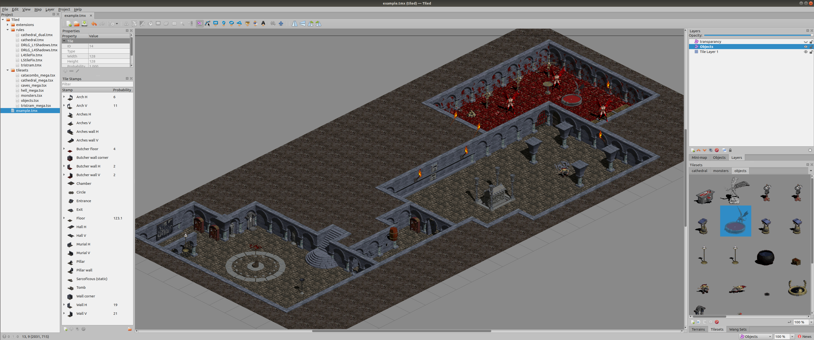
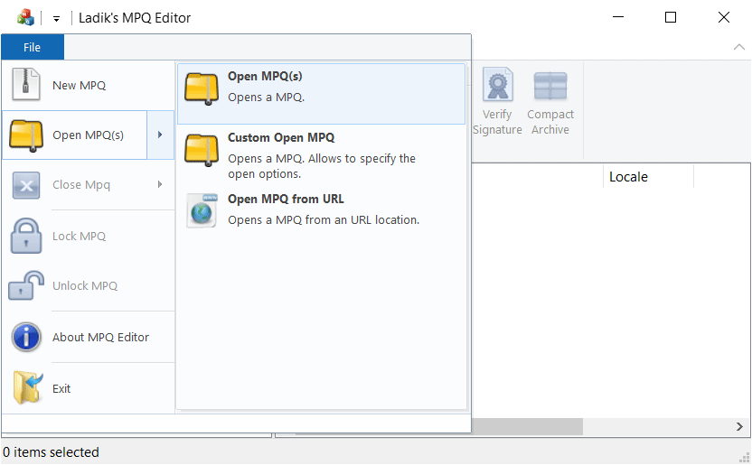
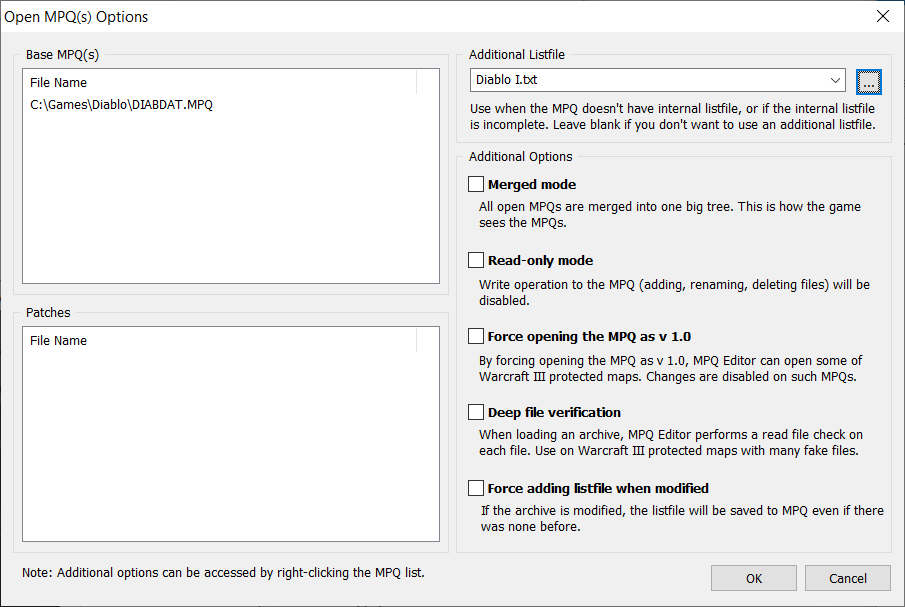
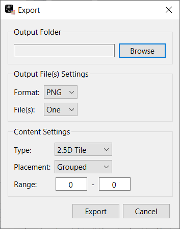
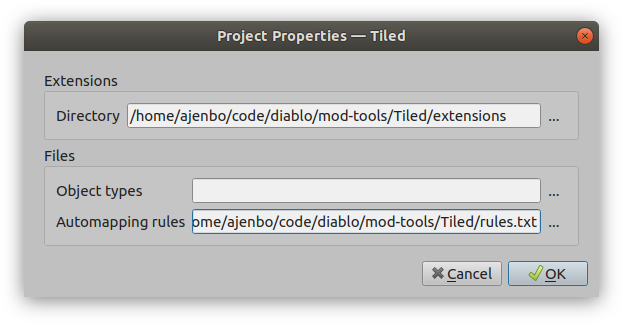
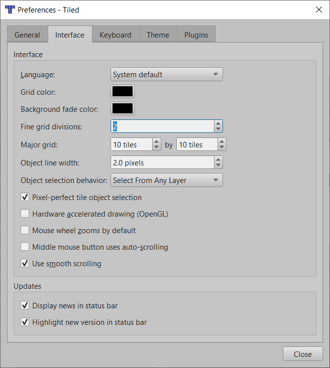
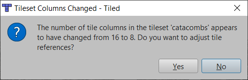

# Diablo 1 level editing with Tiled

We provide an extension that allows [Tiled](https://www.mapeditor.org/) to open and save to the DUN-file format used by Diablo. You will also find a series of prefabricated stamps, as well as an extensive set of rules for automating parts of the process of creating an interesting and detailed level.

## Setting up Tiled

### Installation

First step is to download and install [Tiled](https://www.mapeditor.org/), we recommend version 1.4 or higher as it makes setting up the tool a lot simpler, but 1.3 should also work.

Then download [this repository](https://github.com/diasurgical/modding-tools/archive/master.zip).

Next, you will need an MPQ Editor to extract the necessary files, downloads are available at the top of the page: [Ladik's MPQ Editor](http://www.zezula.net/en/mpq/download.html).

Open diabdat.mpq, and later hellfire.mpq.

It will ask for a listfile, scroll to the bottom of the page: [Listfile](http://www.zezula.net/en/mpq/download.html#ListFiles).

Click the three dots ... on the top right, highlighted in blue to provide the MPQ editor with the listfile.

Once the mpqs are opened with the listfile, you must extract the 'levels' folder from diabdat.mpq and the 'Nlevels' folder from hellfire.mpq

Next you will need a .png version of the tile sheets, this can be done using [Diablo 1 Graphics Tool](https://github.com/savagesteel/d1-graphics-tool).

Once in D1GraphicsTool, open each level .cel file and export one at a time into a .png spritesheet with the following settings:

This should should give you the 7 needed PNG-files for the tiles. Place them in the `Tiled/tilesets` folder of this repository's files.

    levels/l1data/l1.cel -> Tiled/tilesets/l1_til.png
    levels/l2data/l2.cel -> Tiled/tilesets/l2_til.png
    levels/l3data/l3.cel -> Tiled/tilesets/l3_til.png
    levels/l4data/l4.cel -> Tiled/tilesets/l4_til.png
    levels/towndata/town.cel -> Tiled/tilesets/town_til.png
    NLevels/L5Data/L5.CEL -> Tiled/tilesets/L5_til.png
    NLevels/l6data/L6.CEL -> Tiled/tilesets/L6_til.png
    
If you wish to get the spritesheet for Hellfire's town, instead of Vanilla, you must use the town.cel file in the 'Nlevels' folder extracted from hellfire.mpq.
    
    NLevels/TownData/Town.CEL -> Tiled/tilesets/town_til.png
    
*Note that D1Graphicstool cannot export spritesheets for monsters and objects.

### Setting up tiled

First open the project file `diablo.tiled-project` in the `Tiled` folder of this repository's files.

From the menu select `Project->Project Properties`, here you need to point Tiled to the `extensions` folder and the `rules.txt` file:

Next go to `Edit->Preferences->Interface` and change `Fine grid divisions` to `2`.

Then from the `View` menu set `Snapping` to `Snap to Fine Grid`

*Note: If you get the following message when opening maps or tilesets select No to retain the original number of columns in the tilesets.

To open a DUN-file used by Diablo you need to first have the following two tilesets opened:

    Tiled\tilesets\monsters.tsx
    Tiled\tilesets\objects.tsx

Any dungeon tilesets used by the DUN-file must also be opened:

    Tiled\tilesets\cathedral_mega.tsx
    Tiled\tilesets\catacombs_mega.tsx
    Tiled\tilesets\caves_mega.tsx
    Tiled\tilesets\hell_mega.tsx
    Tiled\tilesets\tristram_mega.tsx
    Tiled\tilesets\hive.tsx
    Tiled\tilesets\crypt.tsx